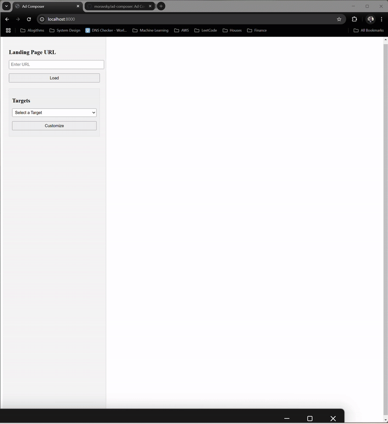

# Ad Composer

Ad Composer is a full-stack application for personalizing landing pages using AI. It uses Django with REST Framework for both the web interface and API, integrated with OpenAI.

## Demo
### Generic Peronsalization


### Deep Personalization


## System Architecture

- **Web & API**: Django application with DRF API endpoints and OpenAI integration
- **Database**: PostgreSQL
- **Development/Production**: Docker containerization

## Project Structure

```
AD-COMPOSER/
├── assets/           # Asset files
├── db/               # Database files
│   └── init/         # Database initialization
├── web/              # Django web application
    ├── ad_composer/  # Main Django app
    ├── config/       # Django project configuration
    ├── myenv/        # Virtual environment
    └── staticfiles/  # Static files
```

## API Endpoints

### Get Account Names
- `GET /api/account-names`
  - Returns a list of available account names from the database
  - Response: Array of account names

### Personalize Text
- `POST /api/personalize`
  - Personalizes text content for a specific client using AI
  - Request Body:
    ```json
    {
      "client": "client_name",
      "texts": ["text1", "text2", ...]
    }
    ```
  - Response:
    ```json
    {
      "client": "client_name",
      "originalTexts": ["text1", "text2", ...],
      "personalizedContent": ["personalized1", "personalized2", ...]
    }
    ```

### Fetch URL
- `GET /fetch-url/?url=https://example.com`
  - Fetches a web page and returns its HTML content
  - Response: HTML content of the requested page

## Prerequisites

- Docker and Docker Compose
- Python 3.9+ (for local development)
- PostgreSQL 16+ (for local development)

## Quick Start with Docker

1. Clone the repository:
```bash
git clone https://github.com/yourusername/ad-composer.git
cd ad-composer
```

2. Set up environment variables:
```bash
cp .env.example .env
# Edit .env with your configuration including OpenAI API key
```

3. Start the services:
```bash
docker-compose up --build
```

The application will be available at:
- http://localhost:8000

## Local Development Setup

1. Create and activate virtual environment:
```bash
python -m venv venv
source venv/bin/activate  # On Windows: venv\Scripts\activate
```

2. Install dependencies:
```bash
pip install -r requirements.txt
```

3. Run migrations:
```bash
python manage.py migrate
```

4. Start the development server:
```bash
python manage.py runserver
```

## Database Setup

The database is automatically initialized with Docker. For local development:

1. Create PostgreSQL database:
```bash
createdb tofudb
```

2. Run initialization scripts:
```bash
psql -d tofudb -f db/create-db.sql
```

## Environment Variables

```
DB_USER=tofu_user
DB_HOST=db
DB_DATABASE=tofudb
DB_PASSWORD=your_secure_password
DB_PORT=5432
SECRET_KEY=your_secure_django_secret
DEBUG=False
ALLOWED_HOSTS=localhost,127.0.0.1
OPENAI_API_KEY=your_openai_api_key
```

## Production Deployment

The application is configured for deployment using Docker:

```bash
docker-compose up --build
```

## License

This project is licensed under the MIT License - see the [LICENSE](LICENSE) file for details.
